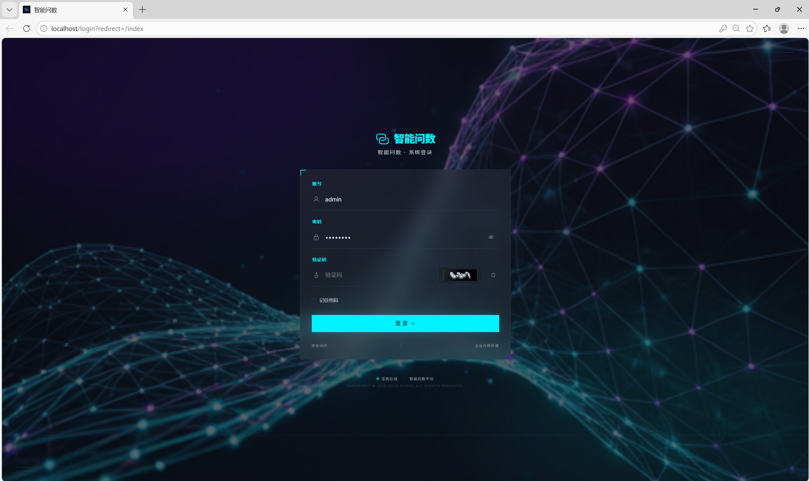
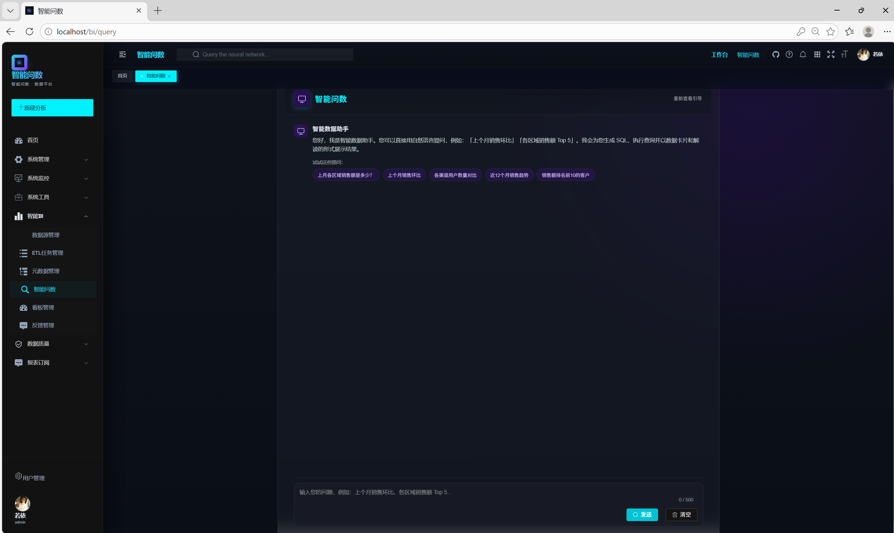
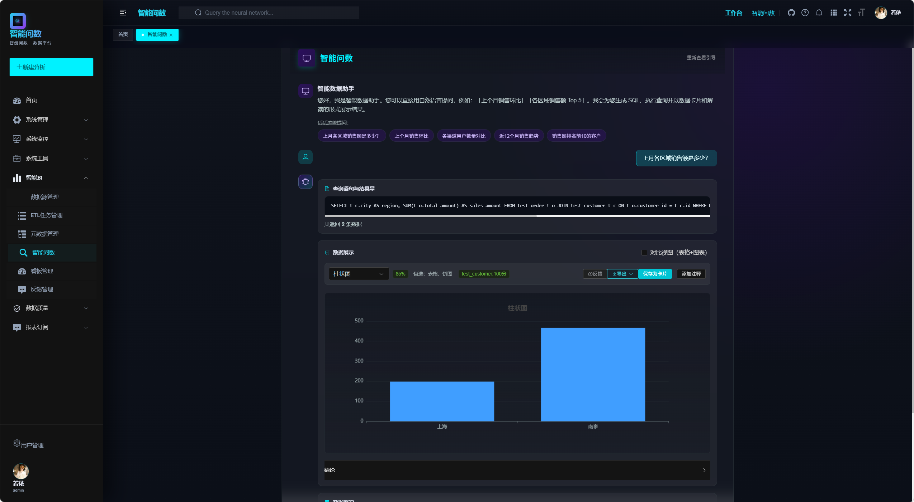
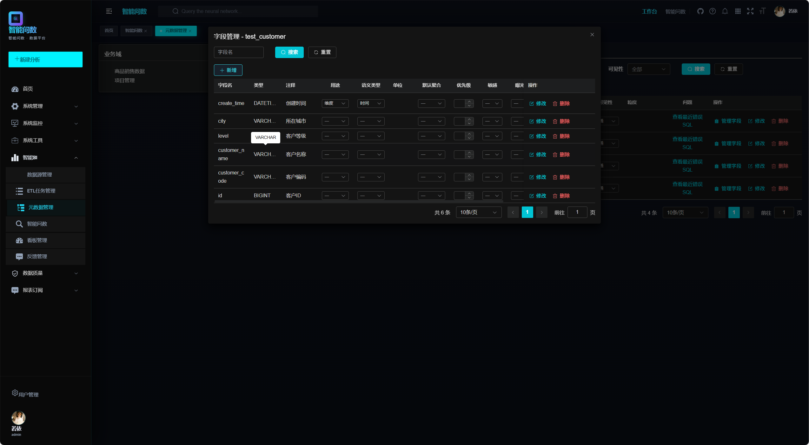
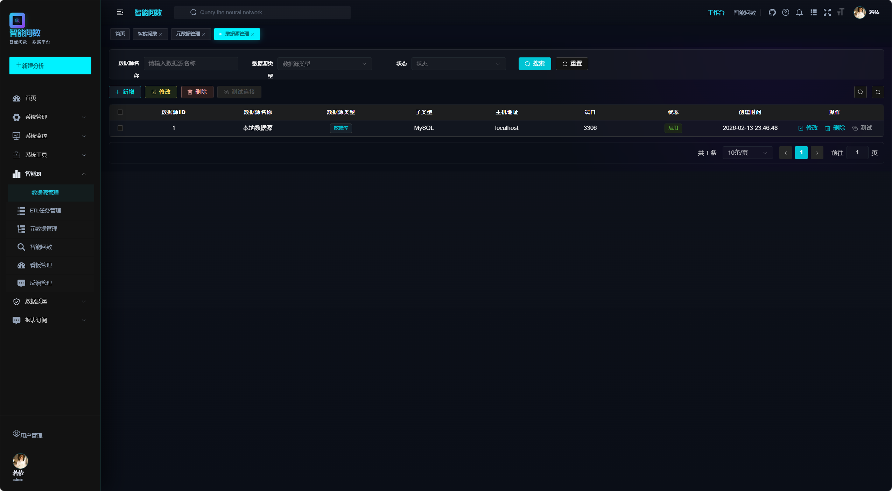
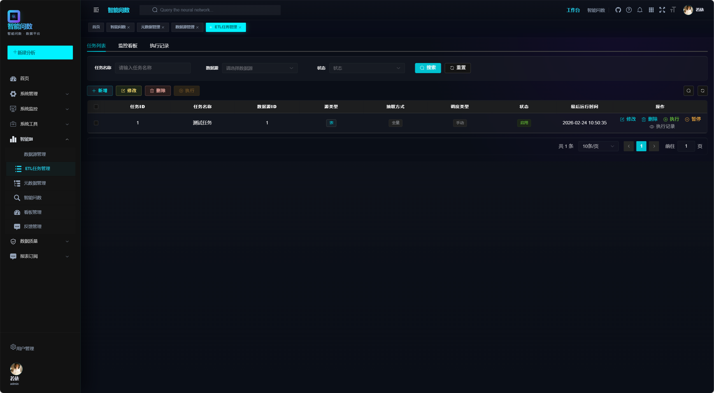
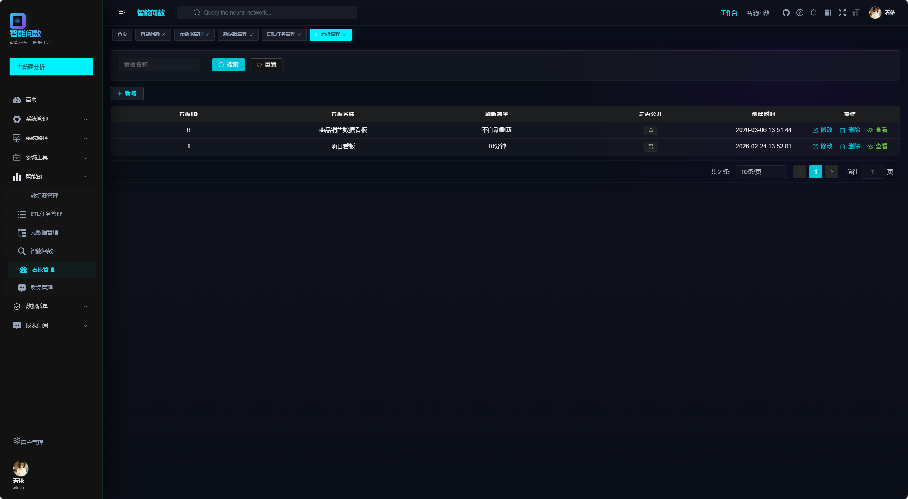
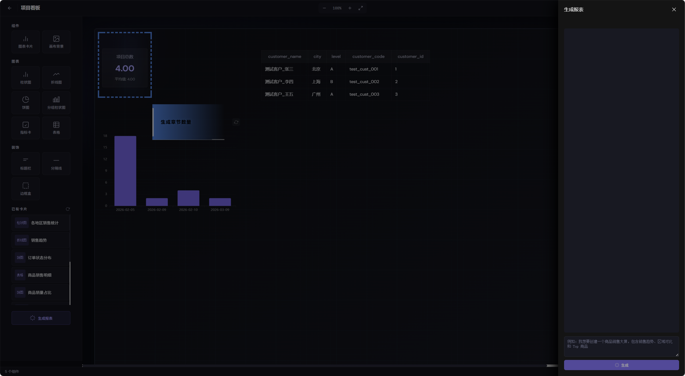

# Smart BI（Agent BI）

<p align="center">
  
</p>

<p align="center">
  基于 Spring AI 的智能问数与可视化报表系统<br/>
  面向业务人员的自然语言问数、<strong>自然语言生成数据看板</strong>、语义层管理与看板协作；数据入仓同步依托 <strong>DataX</strong>
</p>

<p align="center">
  <a href="./LICENSE"></a>
  
  
  
  
</p>

---

## 项目简介

**Smart BI（Agent BI）** 帮助业务人员用自然语言完成数据查询与图表展示，降低对复杂 SQL 与工具的依赖。系统在若依（RuoYi）管理后台能力之上，扩展数据源、基于 **DataX** 的离线同步、元数据语义层、NL2SQL 智能查询、**由自然语言驱动的看板报表生成**、可视化看板编排与分享协作，并通过 **Spring AI** 统一接入大模型能力。

### 核心能力

| 方向 | 说明 |
|------|------|
| **数据接入与 DataX 同步** | 多种关系型数据源与 API；ETL 任务由平台根据配置**动态生成 DataX JSON**，调度执行**全量/增量**同步，并支持任务监控与重试（需本机部署 DataX 运行环境） |
| **语义层** | 业务域、表/字段元数据、指标与维度；向量检索（Qdrant）辅助语义理解 |
| **智能查询** | 自然语言问数、NL2SQL、多轮上下文、结果可视化（ECharts） |
| **自然语言生成数据看板** | 用户用一句话描述「想要什么样的大屏/看板」，大模型先**规划**多块报表（标题、图表类型、各块对应的自然语言问句），再**逐项 NL2SQL、执行 SQL 并生成图表卡片**，自动给出画布**布局坐标**，可在设计器中继续微调 |
| **报表与协作** | 卡片与看板的手动编排、定时刷新、分享链接、权限与审计 |

### 技术栈

| 层级 | 技术 |
|------|------|
| 后端 | Java 21、Spring Boot 3.x、Spring AI、Spring Security / JWT、MyBatis、Quartz |
| 前端 | Vue 3、Vite、Element Plus、Pinia、Vue Router、ECharts |
| 数据与任务 | MySQL、Redis、Qdrant；**DataX**（离线同步 / ETL 执行引擎，由 `smart-bi-etl` 集成） |

---

## 界面预览


| 登录 | 智能查询（对话） |
|:---:|:---:|
|  |  |

| 查询结果 | 元数据 / 语义层 |
|:---:|:---:|
|  |  |

| 数据源 | ETL |
|:---:|:---:|
|  |  |

| 看板列表 | 看板设计器 |
|:---:|:---:|
|  |  |

---

## 仓库结构

```
smart-bi/
├── smart-bi-admin/       # 主应用入口与配置
├── smart-bi-common/      # 通用工具与常量
├── smart-bi-framework/   # 安全、数据源、AOP 等框架层
├── smart-bi-system/      # 系统管理（用户、角色、菜单等，基于若依）
├── smart-bi-quartz/      # 定时任务
├── smart-bi-generator/   # 代码生成
├── smart-bi-datasource/  # 数据源管理
├── smart-bi-etl/         # ETL 管理
├── smart-bi-metadata/    # 元数据与语义层
├── smart-bi-query/       # 智能查询 / NL2SQL
├── smart-bi-dashboard/   # 看板与报表
├── smart-bi-quality/     # 数据质量相关
├── smart-bi-push/        # 推送/订阅等扩展能力
├── smart-bi-ui/          # 前端（Vue 3 + Vite）
├── sql/                  # 初始化与增量脚本（含 patches）
├── specs/                # 功能规格与任务拆分
├── docs/screenshots/     # README 界面截图
└── .specify/             # 项目规范与宪章
```

---

## 快速开始

### 环境要求

- JDK 21、Maven 3.6+
- Node.js 18+
- MySQL 8.0+
- Redis
- Qdrant（向量检索）
- **DataX**（完整安装包）：使用 ETL 离线同步时需在本机配置 DataX 安装目录

### 数据库初始化

1. 创建 MySQL 库，执行：`sql/ry_20250522.sql`、`sql/quartz.sql`
2. 执行 Agent BI 相关脚本：`sql/agent_bi_init.sql`
3. 按需顺序执行 `sql/patches/` 下增量脚本

### 配置

编辑 `smart-bi-admin/src/main/resources/application.yml`，至少配置：

- **MySQL**：`spring.datasource.*`
- **Redis**：`spring.data.redis.*`
- **Qdrant**：项目中 `qdrant` 配置项
- **大模型**：`spring.ai.*`（如 OpenAI 兼容接口的 `api-key`、`base-url`）
- **DataX**：`datax.homePath` 指向本机 DataX 根目录（如 `/opt/datax`）

### 启动

**后端**：

```bash
cd smart-bi-admin
mvn spring-boot:run
```

**前端**：

```bash
cd smart-bi-ui
npm install
npm run dev
```

### 访问

- 前端：`http://localhost:80`
- 后端 API：`http://localhost:1111`
- 默认演示账号：`admin` / `admin123`

---

## 主要功能模块说明

### 数据源管理 (`smart-bi-datasource`)
支持多种关系型数据库连接，提供数据源测试、表结构查询等功能。

### ETL 任务 (`smart-bi-etl`)
基于 DataX 的离线数据同步，支持全量/增量同步，任务调度与监控。

### 元数据与语义层 (`smart-bi-metadata`)
管理业务域、表/字段元数据、指标与维度，支持向量检索辅助语义理解。

### 智能查询 (`smart-bi-query`)
自然语言转 SQL（NL2SQL），多轮对话上下文，结果可视化展示。

### 看板与报表 (`smart-bi-dashboard`)
数据看板的创建、编辑、布局配置，支持自然语言生成看板、图表卡片管理、分享协作。

### 数据质量 (`smart-bi-quality`)
数据质量规则管理、评分计算、质量报告生成与导出。

### 推送订阅 (`smart-bi-push`)
报表订阅推送，支持定时任务、异常检测、趋势告警等功能。

---

## 参与贡献

欢迎 Issue 与 Pull Request。建议：

1. 先阅读项目宪章与相关 `specs/`，保持与现有架构一致
2. 提交信息可采用约定式提交：`feat(scope): 简述`、`fix(scope): 简述`
3. 变更若影响部署或配置，请同步更新文档

---

## 许可证

本项目为 **MIT** 许可证。

基础后台能力来自 **[若依 RuoYi-Vue](https://gitee.com/y_project/RuoYi-Vue)**，感谢若依团队。

AI 能力基于 **[Spring AI](https://docs.spring.io/spring-ai/reference/)**；向量检索参考 [Qdrant](https://qdrant.tech/documentation/)；ETL 参考 [DataX](https://github.com/alibaba/DataX)。

---

## 相关链接

- 若依文档：<http://doc.ruoyi.vip>
- Spring AI：<https://docs.spring.io/spring-ai/reference/>
- DataX：<https://github.com/alibaba/DataX>
